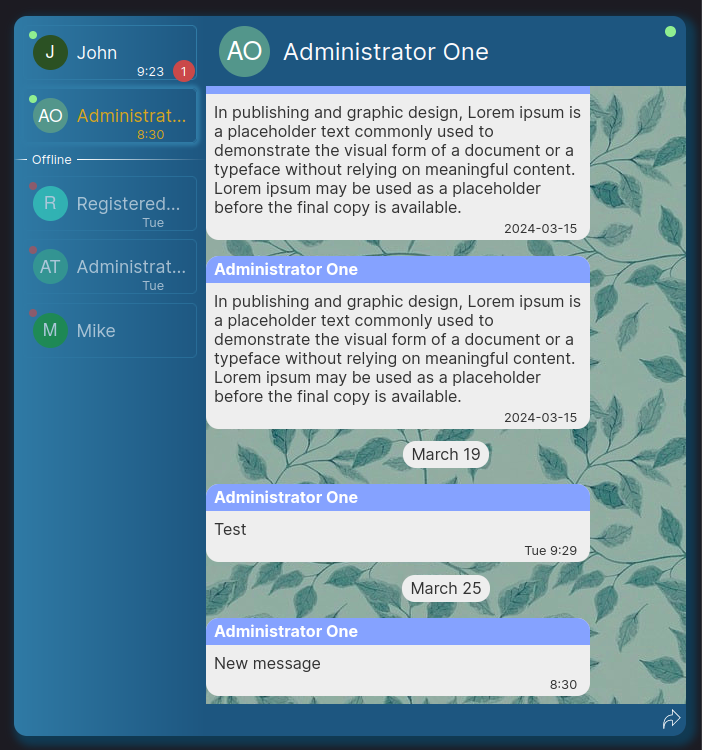
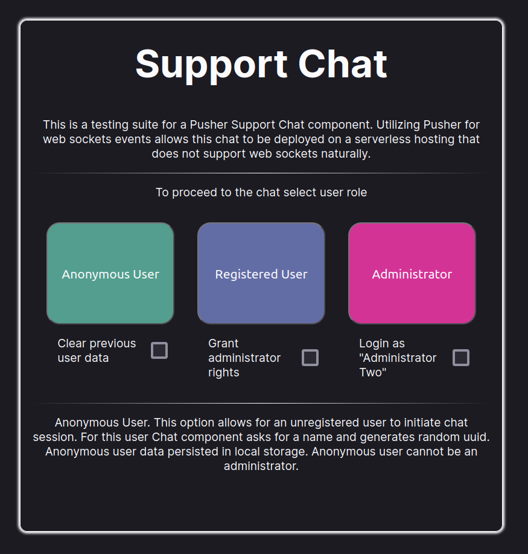
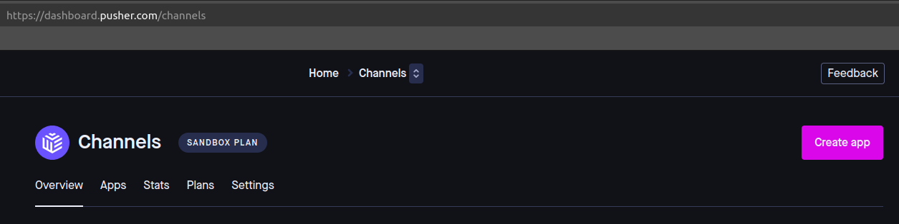
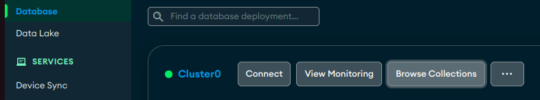
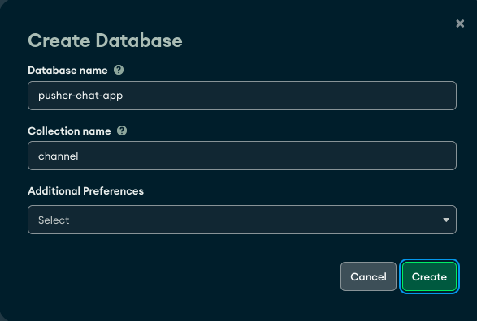
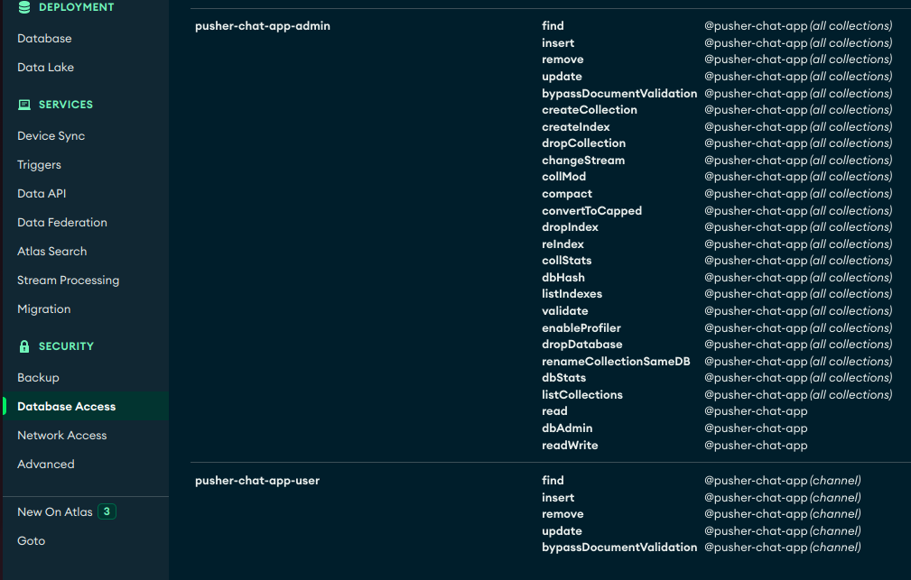
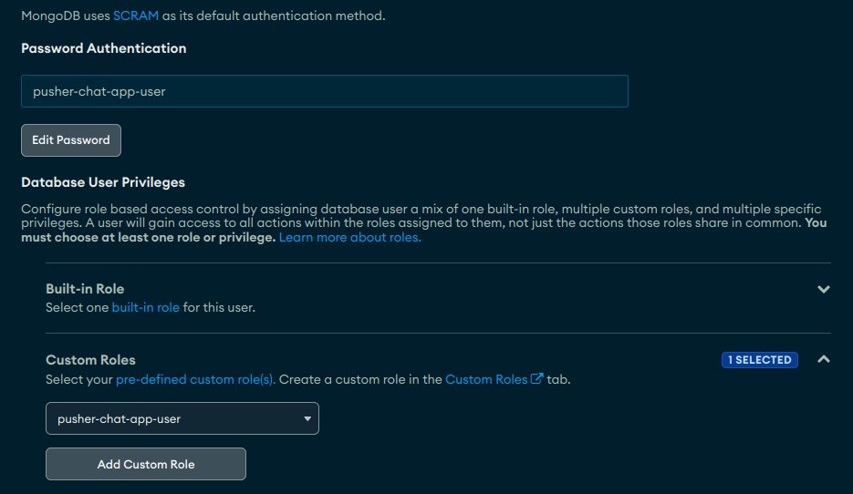
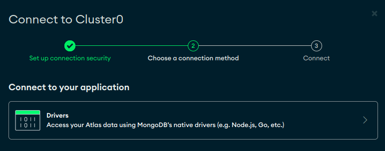

This is a Support Web Chat project build with the idea of independence from hosting and database environment.

## Table of contents

- [Overview](#overview)
- [Demo](#demo)
- [Quick Setup](#quick-setup)
- [Project Description](#project-description)
  - [Life Cycle](#life-cycle)
  - [Back-end Protection](#backend-protection)
  - [Built with](#built-with)
  - [Future Development](#future-development)
- [Author](#author)

## Overview

Support Web Chat saves you the hassle of figuring out whether your hosting provider supports websockets and/or your DB has real-time events support. With Support Web Chat you can pick any resources you want and it will work there. Powered by the [Pusher](https://pusher.com/) Support Web Chat creates an easy developer experience while providing rich set of features, such as: user roles separation, paginated chat history, typing and new messages detection, and encrupted api endpoints protection.



## Demo

This demo showcases real-time functionality on a Vercel edge deployment, without websockets support, and MongoDB with no real-time events support.

For demonstartion purposes demo is wrapped in a fake User Data provider. You can select the role you want to test Support Web Chat with.

[Live Demo](https://chat-app-pusher-one.vercel.app/)

[](https://chat-app-pusher-one.vercel.app/)

## Quick Setup

1. Clone project. Install dependencies

```bash
npm install
```

2. Rename .env.local.example to .env.local, and .env.example to .env (Make sure .env and .env.local are added as exception in .gitignore)
3. Pusher
   - Register with Pusher [Pusher](https://pusher.com/)
   - Create a new app in channels
     
   - Navigate to the created app dashboard -> App Keys
   - Copy Pusher information into .env.local environmental variables
   ```
   NEXT_PUBLIC_PUSHER_APP_ID="app_id"
   NEXT_PUBLIC_PUSHER_SECRET="secret"
   NEXT_PUBLIC_PUSHER_KEY="key"
   NEXT_PUBLIC_PUSHER_CLUSTER="cluster"
   ```
4. MongoDB

   To safely work with MongoDB we need to create a USER that only has access to CRUD operations for the chosen database. However, in order to initialize project we need a wider spectres or rights. Therefore we are going to create two access roles: USER and ADMIN. ADMIN will be used once, in order to initialize the project, and the main workflow will be done with USER rights. Below are the steps necessary to complete the setup.

   - Register with MongoDB [MongoDB](https://www.mongodb.com/)
   - Creating Database

     - Navigate to Deplyoment / Database / Browse Collections

       

     - press Create Database and fill the fields.
       Database Name: "pusher-chat-app" (can be any name, as long as consistent with the rest of the connection settings)
       Collection Name: "channel" (must be "channel", used by Prisma)

       

   - Creating Users

     - Navigate to Left Panel / Security / Database Access. Switch to "Custom Roles" tab. We will add two roles for the project. "pusher-chat-app-admin" with the rights sufficient to initialize the project's database. And "pusher-chat-app-user" that will be mainly used, after the project initialization.
     - Click "add new custom role" and add two roles

       

     - Switch to the Database Users tab and click "add new database user" to add two new users:
       "pusher-chat-app-admin" with a custom role "pusher-chat-app-admin"
       "pusher-chat-app-user" with a custom role "pusher-chat-app-user"

       

   - Assembling connection string

     - We are going to need the name of the MongoDB cluster. Navigate to Left Panel / Database. Click "Connect" button. Click "Connect to your application" / Drivers

       

     - In your .env file there are already two connection string tempates. Make sure that the cluster name in .env is the same as you see in your MongoDB profile
     - In .env file replace user names, user passwords, and database name with your data. If your user names or passwords include special characters they need to be URL-encoded (https://www.mongodb.com/docs/atlas/troubleshoot-connection/#special-characters-in-connection-string-password).
     - Finally temporarily comment out user connection string for DB initialization with admin rights.

   - DB initialization.
     - Run command:
     ```bash
     npx prisma db push
     ```
     - After successfule initialization in .env file uncomment user string and comment out admin.

5. Additional environmental variables. In your .env.local file you have two more variables: NEXT_PUBLIC_LOCAL_STORAGE_UUID, NEXT_PUBLIC_API_SIGNATURE_KEY.
   - NEXT_PUBLIC_LOCAL_STORAGE_UUID: used as name for a localStorage data used by anonymous user. Its value can be any string, as long as it does not conflict with other applications storing data in localStorage. E.g.
   ```
   NEXT_PUBLIC_LOCAL_STORAGE_UUID="pusher-chat-anonymous-user-72tbDrFkjAgn3"
   ```
   - NEXT_PUBLIC_API_SIGNATURE_KEY: used as an encryption key for api requests in order to filter out api requests not originated from the intended front-end. Its value is a string comprised of 32 random characters. You can generate it using command:
   ```bash
   openssl rand -base64 24
   ```
   (WARNING! Do not store this string publicly)
6. All done! Now you can start your project in dev mode using

```bash
npm run dev
```

Open [http://localhost:3000](http://localhost:3000) with your browser to see the result.

## Project Description

The idea behind this project is to create a Support Web Chat that would be independent from hosting and database used. For this purpose websockets functionality is realised via Pusher service.

### Life Cycle

1. Upon rendering the Chat element takes optional user data as props. If no user data provided user is considered Anonymous.
2. For anonymous user shown dialog prompting to enter a name. user_id is generated as UUIDv4. Collected data saved in localStorage.
3. Pusher connection established with user data
4. UserID and Pusher connection data stored in Outer Contexts
5. Inner Contexts are initialised based on UserID and Pusher connection data. Inner Contexts are separated for code readability. Each of them stores a slice of data in form of an array with the room id and context specific data. The Inner Contexts are:

- ChatData: contains data array with room messages.
- ChatRooms: contains room meta information: owner data, list of currently subscribed users, last message timestamp.
- Pagination: contains data in regards to remaining history pages for the room. PaginationMarker element added to the top of messages in ChatBody if Pagination context for the room has hasMore flag set to true. When PaginationMarker element is scrolled into view new history page is loaded.
- ScrollPosition: contains information about current scroll position for the room. Based on this data various scroll events (scroll to the new message, scroll to the last scroll position on room change...) are processed.
- UsersTyping: contains list of users who have been editing SendMessage form input field. This activity is tracked and shared by Pusher "typing" event among subscribers to the room in order to display "user typing" notification.
- KnownUsers: unlike previous contexts is not tied to the room. Contains information (name, level of rights) about users in order to display it instead of user_id. KnownUsers is populated on each new user_id encounter. If user information changes (name change or user rights) update in KnownUsers will update this data throughout the app.

6. useSubscription is the main workloop that tracks Pusher events and modifies Inner Contexts data
7. When application is closed pusher connection is cleaned up in usePusherConnection hook.

### Back-end Protection

Next.js is used to create the back-end API endpoints for this web application. These endpoints employ a two-fold security approach for access control.

#### Authentication Protection

Authentication routes are shielded from unauthorised access by implementing a mechanism that verifies an encrypted signature. This signature is generated using the environment variable NEXT_PUBLIC_API_SIGNATURE_KEY, which is shared between the front-end and back-end (in this case, residing within the same code repository).

API authentication endpoints specifically process requests that include a valid "pusher-chat-signature" header. The cryptographic algorithm used for this signature generation is AES-256-CBC.

#### Authorization with JWT

For all other endpoints, access is restricted through JWT (JSON Web Token) authentication verification. JWT is also leveraged to implement role-based access control for these endpoints.

### Built with

Support Web Chat is made with Next.JS, Pusher, TypeScript, SCSS, Prisma. Data validation - Zod. Testing - Vitest.

If you have questions or ideas your feedback and contributions are welcome!

### Future Development

Additional features to add:

- "Away" status
- Session termination for a user on an inactivity timeout
- "Message has been seen" status indicator
- Design and CSS features

## Author

- Website - [WarlockJa](https://www.warlockja.ru)
